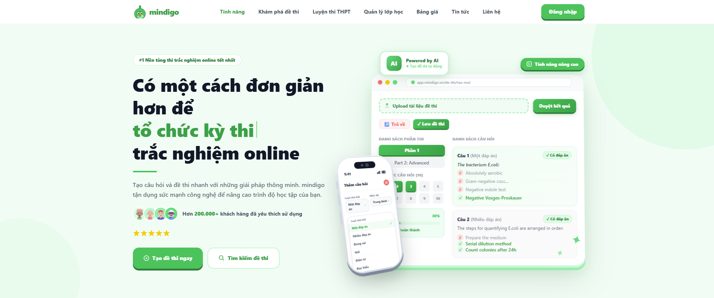
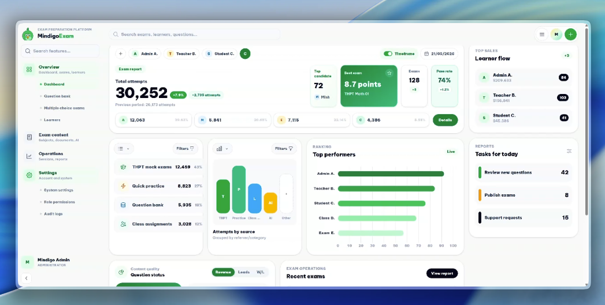
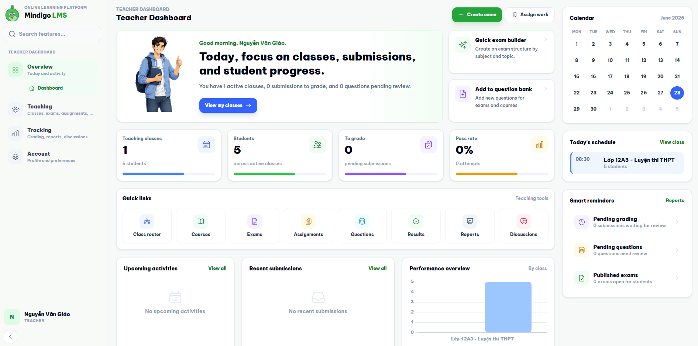
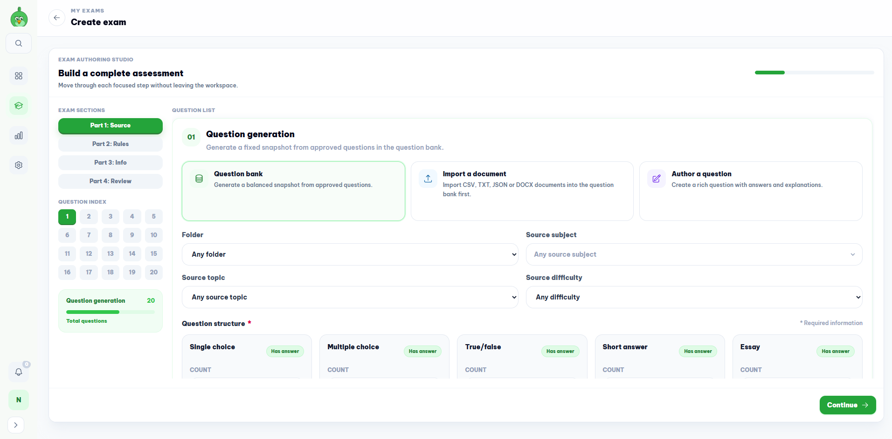
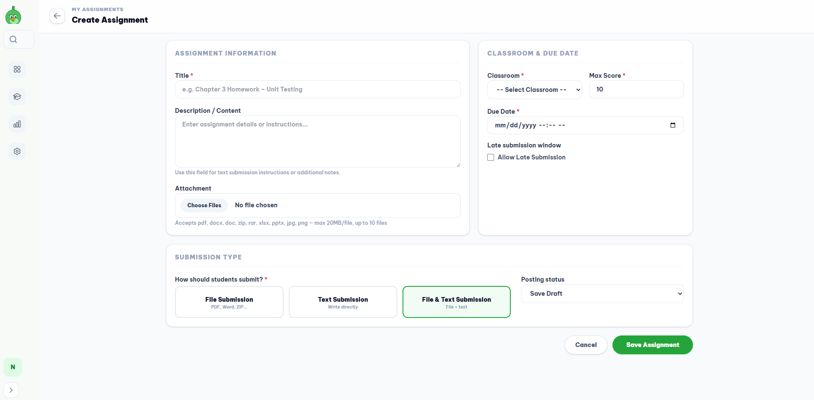
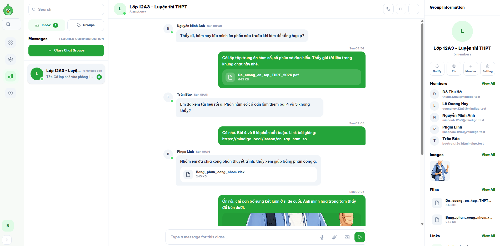
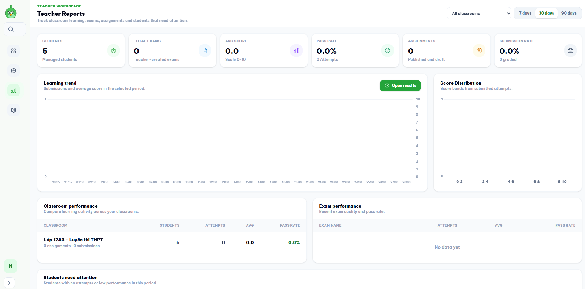
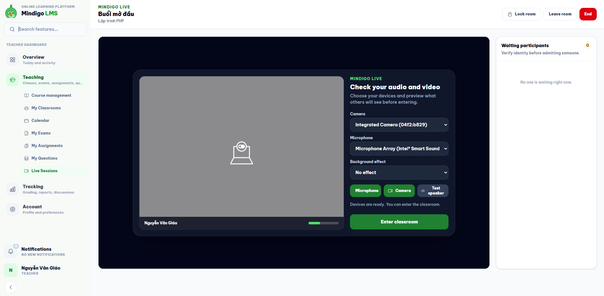

<p align="center">
  
</p>

<h1 align="center">Mindigo LMS</h1>

<p align="center">
  <strong>A Laravel-based learning management system for admins, teachers, and students.</strong><br>
  Manage classrooms, courses, question banks, exams, assignments, results, reports, internal discussions, and live sessions.
</p>

<p align="center">
  
  
  
  
  
</p>

---

## Table Of Contents

- [Overview](#overview)
- [Core Features](#core-features)
- [Demo Screens](#demo-screens)
- [Module Architecture](#module-architecture)
- [Tech Stack](#tech-stack)
- [Local Setup](#local-setup)
- [Production Deployment](#production-deployment)
- [Demo Accounts](#demo-accounts)
- [Development Commands](#development-commands)
- [Development Guidelines](#development-guidelines)
- [License](#license)

---

## Overview

**Mindigo LMS** is a modular learning management system built with Laravel. The application is organized around three main user experiences:

- **Admin** manages platform data, users, subjects, classrooms, question banks, exams, reports, support tickets, and audit logs.
- **Teachers** manage classes, courses, questions, exams, assignments, grading, reports, announcements, class discussions, and live sessions.
- **Students** join classrooms, take exams, submit assignments, practice questions, track schedules and progress, view history and leaderboards, write notes, and participate in discussions or live sessions.

The goal of the project is to provide a clear, extensible LMS foundation with consistent UI patterns and practical workflows for online learning.

---

## Core Features

### Administration

- Authentication, password recovery, OTP, and Mindigo ID flows.
- User management, roles, permissions, and account status control.
- Subject, topic, classroom, and classroom member management.
- Question bank with folders, import flow, review status, and edit history.
- Exam, exam attempt, result, and reporting management.
- System settings, profile management, support tickets, and audit logs.

### Teacher Workspace

- Teacher dashboard focused on active classes, students, grading, reminders, schedules, and performance.
- Classroom management with schedules, attendance, and student rosters.
- Course management with chapters and lessons.
- Teacher-owned question and exam management.
- Assignment creation, submission review, grading, and feedback.
- Result review by exam, by student, and by attempt.
- Reports for classes, students, exams, and learning progress.
- Class announcements.
- Internal class discussions with a chat-style interface, images, files, and group information.
- Live session creation and management.

### Student Workspace

- Student dashboard with assigned work, schedule, progress, and recent activity.
- Classroom overview and related learning content.
- Exam taking, result review, and attempt history.
- Assignment receiving and submission through files or text.
- Question practice workflows.
- Schedule, learning progress, and leaderboard pages.
- Personal notebook.
- Class discussions and live session participation.

---

## Demo Screens

<p align="center">
  
  <br><em>Mindigo dashboard overview.</em>
</p>

<table>
  <tr>
    <td width="50%">
      
      <br><strong>Teacher Dashboard</strong>
    </td>
    <td width="50%">
      
      <br><strong>Exam Management</strong>
    </td>
  </tr>
  <tr>
    <td width="50%">
      
      <br><strong>Assignments & Submissions</strong>
    </td>
    <td width="50%">
      
      <br><strong>Class Discussions</strong>
    </td>
  </tr>
  <tr>
    <td width="50%">
      
      <br><strong>Teacher Reports</strong>
    </td>
    <td width="50%">
      
      <br><strong>Student Live Sessions</strong>
    </td>
  </tr>
</table>

<p align="center">
  <video src="screenshots/mindigo.mp4" width="900" controls></video>
  <br><em>Mindigo workflow demo video.</em>
</p>

---

## Module Architecture

Mindigo is organized as internal Composer path packages inside the `packages/` directory.

### `packages/Mindigo`

| Module | Purpose |
| ------ | ------- |
| `Auth` | Login, OTP, Mindigo ID, role middleware |
| `Core` | Public homepage and public layout |
| `Dashboard` | Shared dashboard shell, sidebar, search, and layout |
| `UserManagement` | User account management |
| `RolePermission` | Roles and permissions |
| `SystemSetting` | System configuration |
| `AuditLog` | Activity and operation logs |
| `SubjectManagement` | Subjects and topics |
| `ClassroomManagement` | Platform-level classroom management |
| `QuestionBank` | Question bank management |
| `ExamManagement` | Base exam and attempt management |
| `Report` | Admin, teacher, and student reports |
| `SupportManagement` | Support tickets |
| `Profile` | Profile, security, and notification preferences |
| `BlogManagement` | News and blog content |

### `packages/Teacher`

| Module | Purpose |
| ------ | ------- |
| `TeacherDashboard` | Teacher dashboard |
| `TeacherClassroom` | Classrooms, schedules, and attendance |
| `TeacherCourse` | Courses, chapters, and lessons |
| `TeacherQuestion` | Teacher question management |
| `TeacherExam` | Teacher exam management |
| `TeacherAssignment` | Assignments and submissions |
| `TeacherResult` | Results, grading, and attempt review |
| `TeacherAnnouncement` | Class announcements |
| `TeacherDiscussion` | Internal class discussions |
| `TeacherLiveSession` | Live sessions |

### `packages/Students`

| Module | Purpose |
| ------ | ------- |
| `StudentDashboard` | Student dashboard |
| `StudentClassroom` | Student classrooms |
| `StudentExam` | Exam taking |
| `StudentAssignment` | Assigned work and submissions |
| `StudentPractice` | Practice sessions |
| `StudentSchedule` | Learning schedule |
| `StudentProgress` | Learning progress |
| `StudentHistory` | Attempt and activity history |
| `StudentLeaderboard` | Leaderboard |
| `StudentNotebook` | Personal notes |
| `StudentDiscussion` | Class discussions |
| `StudentLiveSession` | Live session participation |

---

## Tech Stack

| Layer | Technology |
| ----- | ---------- |
| Backend | Laravel 12, PHP 8.2+ |
| Frontend | Blade, Tailwind CSS 4, Vite |
| UI Icons | Blade Heroicons |
| Database | MySQL or MariaDB |
| PDF/Export | `barryvdh/laravel-dompdf` |
| Internal packages | Composer path repositories |

---

## Local Setup

### 1. Clone the repository

```bash
git clone https://github.com/scoppy9201/Mindigo.git
cd Mindigo
```

### 2. Install dependencies

```bash
composer install
npm install
```

### 3. Create the environment file

```bash
cp .env.example .env
php artisan key:generate
```

### 4. Configure the database in `.env`

```env
APP_NAME=Mindigo
APP_URL=http://127.0.0.1:8000

DB_CONNECTION=mysql
DB_HOST=127.0.0.1
DB_PORT=3306
DB_DATABASE=mindigo
DB_USERNAME=root
DB_PASSWORD=
```

### 5. Run migrations and seeders

```bash
php artisan migrate --seed
php artisan storage:link
```

### 6. Start the application

```bash
php artisan serve
npm run dev
```

Open:

```text
http://127.0.0.1:8000
```

---

## Production Deployment

Mindigo can be deployed on an Ubuntu virtual machine with Docker Compose. This setup is suitable for demo, internal testing, and production-like deployment when the server is behind NAT and does not have a public IP.

For the full CI/CD webhook guide, see:

```text
docs/6-ci-cd-github-actions.md
```

### 1. Server Requirements

- Ubuntu Server running in VMware, VirtualBox, VPS, or a physical server.
- Docker and Docker Compose plugin.
- Git access to the repository.
- A configured `.env` file or Docker environment variables.
- Optional: ngrok static domain when the VM does not have a public IP.

### 2. Clone And Build On The VM

```bash
cd /home/hung/mindigo
git clone https://github.com/scoppy9201/Mindigo.git
cd Mindigo
docker compose up -d --build
docker compose ps
curl -I http://localhost:8080
```

The default Docker Compose stack exposes:

| Service | URL |
| --- | --- |
| Application | `http://<IP_UBUNTU>:8080` |
| phpMyAdmin | `http://<IP_UBUNTU>:8081` |
| MySQL from host | `127.0.0.1:3307` |

### 3. Prepare Laravel In The Container

Run migrations, clear caches, and seed demo accounts:

```bash
docker compose exec app php artisan migrate --force
docker compose exec app php artisan optimize:clear
docker compose exec app php artisan db:seed
```

The production Docker image installs Composer dependencies with `--no-dev`. The database factories are therefore written without depending on `fakerphp/faker`, so seeding still works in a production image.

### 4. CI/CD With GitHub Actions And Webhook

The deployment workflow is:

```text
push main -> GitHub Actions -> build/test -> POST webhook -> ngrok -> Ubuntu VM -> deploy.sh
```

Create these GitHub repository secrets:

| Secret | Example |
| --- | --- |
| `WEBHOOK_URL` | `https://your-ngrok-domain.ngrok-free.dev/deploy` |
| `WEBHOOK_SECRET` | `mindigo-secret` |

On the Ubuntu VM, copy the webhook files:

```bash
mkdir -p ~/webhook
cp /home/hung/mindigo/Mindigo/deploy/webhook/server.py ~/webhook/server.py
cp /home/hung/mindigo/Mindigo/deploy/webhook/deploy.sh ~/webhook/deploy.sh
chmod +x ~/webhook/server.py ~/webhook/deploy.sh
```

Run the webhook manually for a quick test:

```bash
cd ~/webhook
WEBHOOK_SECRET=mindigo-secret python3 server.py
```

Expose it with ngrok:

```bash
ngrok http 9000
```

For a static ngrok domain:

```bash
ngrok http --domain=your-ngrok-domain.ngrok-free.dev 9000
```

When GitHub calls the webhook successfully, the server runs:

```bash
git fetch origin main
git checkout main
git pull --ff-only origin main
DOCKER_BUILDKIT=1 docker compose build app
docker compose up -d --remove-orphans
docker compose exec -T app php artisan migrate --force
docker compose exec -T app php artisan optimize:clear
```

### 5. Keep Webhook And Ngrok Running

For long-running deployment, create systemd services for:

- `mindigo-webhook.service`
- `mindigo-ngrok.service`

Example webhook service:

```ini
[Unit]
Description=Mindigo deploy webhook
After=network.target

[Service]
Type=simple
User=hung
WorkingDirectory=/home/hung/webhook
Environment=WEBHOOK_SECRET=mindigo-secret
Environment=WEBHOOK_PORT=9000
Environment=APP_DIR=/home/hung/mindigo/Mindigo
ExecStart=/usr/bin/python3 /home/hung/webhook/server.py
Restart=always
RestartSec=3

[Install]
WantedBy=multi-user.target
```

Enable it:

```bash
sudo systemctl daemon-reload
sudo systemctl enable mindigo-webhook
sudo systemctl start mindigo-webhook
sudo systemctl status mindigo-webhook
```

### 6. Moving From VM To A Real Server

The same Docker deployment can be moved to a real VPS or physical server. Replace the VM/ngrok parts with normal public networking:

- Point the domain DNS record to the server public IP.
- Put Nginx, Apache reverse proxy, Caddy, Cloudflare Tunnel, or a load balancer in front of `http://127.0.0.1:8080`.
- Enable HTTPS with Let's Encrypt or the platform certificate manager.
- Set `APP_ENV=production`, `APP_DEBUG=false`, and `APP_URL=https://your-domain.com`.
- Use strong database passwords and application secrets.
- Do not expose phpMyAdmin publicly; remove it or bind it to localhost/VPN only.
- Keep `storage_data` and `db_data` Docker volumes backed up.
- Run `php artisan migrate --force` during deploy, but run `db:seed` only when demo data is needed.

Useful production checks:

```bash
docker compose ps
docker compose logs --tail=100 app
docker compose exec app php artisan about
curl -I http://localhost:8080
```

---

## Demo Accounts

The database seeder creates fixed accounts for quick testing:

| Role | Email | Password |
| ---- | ----- | -------- |
| Admin | `admin@mindigo.com` | `123456` |
| Teacher | `teacher@mindigo.com` | `123456` |
| Student | `student@mindigo.com` | `123456` |

The seeder also creates additional users with factories for list, permission, and classroom testing.

---

## Development Commands

```bash
# Run Vite
npm run dev

# Build production assets
npm run build

# Run Laravel tests
php artisan test

# Clear caches after changing config, providers, or language files
php artisan optimize:clear

# Refresh autoload after adding packages or classes
composer dump-autoload
```

Composer also includes a combined development script:

```bash
composer run dev
```

This starts the Laravel server, queue listener, log tailing, and Vite together.

---

## Development Guidelines

- Keep module boundaries clear across `Mindigo`, `Teacher`, and `Students`.
- Use Blade, Tailwind, and existing shared components/icons.
- Put user-facing text in `resources/lang/vi/app.php` and `resources/lang/en/app.php`.
- Define module web routes in `src/routes/web.php`.
- Keep controllers thin and place core business logic in services.
- Follow the existing color system: system green, slate, amber, violet, and rose as accents.
- When adding a new package module, update Composer path repositories, PSR-4 autoloading, and service provider registration if auto-discovery is not available.

---

## License

Mindigo LMS is released under the [MIT License](LICENSE).

---

<p align="center">
  Developed by <strong>Manh Hung</strong><br>
  Mindigo LMS
</p>
